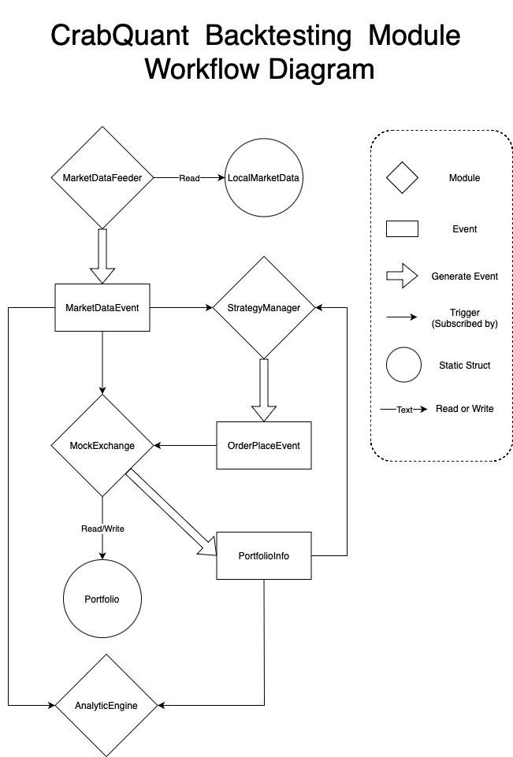

# **ECE 1724**

# **Performant Software Systems with Rust**

# **Final Report**

**Hanzhen Xu | 1004475285 | hanzhen.xu@mail.utoronto.ca**  
**Haoran Zhou | 1003970713 | hr.zhou@mail.utoronto.ca**  
**Yue Chen | 1010813675 | cherylyue.chen@mail.utoronto.ca**

## **Motivation**

Accurate, efficient, and reproducible backtesting is fundamental to the research and development of quantitative trading strategies. As the critical first step in validating a strategy's effectiveness, backtesting allows traders to simulate performance on historical data, offering essential insights before any capital is put at risk in live markets.  
Currently, backtesting frameworks are predominantly Python-based. Python offers advantages in accessibility, ease of use, and a wide range of libraries suited to financial data analysis and model building. For lower-frequency strategies where data volumes are manageable, Python is an ideal tool. However, for higher-frequency strategies, data volumes increase significantly, and it may take several hours or even overnight to complete a single backtest, even for relatively simple strategies. These performance limitations not only slow down the work of individual quantitative analysts, but many quantitative funds also need to maintain separate Python-based backtesting and research environments alongside their actual algorithmic trading deployments in higher-performance languages. This separation introduces additional complexity, uncertainty, and potential inconsistencies between the two environments.  
In this project, we aim to develop a foundational backtesting framework using Rust. This framework will facilitate more efficient backtesting on large high-frequency datasets, enabling the later development of “live trading” modules that promise consistency between testing and trading environments, and benefit from Rust’s efficiency and reliability. The performance and memory safety characteristics of Rust language offer distinct advantages for high-frequency and data-intensive applications, potentially enabling a unified model for both backtesting and live trading in a high-performance setting.

## **Objective**

In general, our objective is to design and build a new rust-based backtesting framework, assisting users to test their own trading strategies on specific dataset. The framework should also include a basic analytic and visualization tool for a descriptive and comparable view on return and risk of their promoted strategies. An example output is shown in the following figure (produced using Python).

 
<div align="center"> Fig 1, Sample backtesting result plot. </div>
<br>
Specifically, the primary objective of the project is modularity. While Rust offers the greatest potential for enhancing an algo-trading framework in both performance and reliability, our focus remains on modularity due to limited resources and the fact that Rust is new to all team members. By prioritizing modularity as our design principle, we aim for the utmost decoupling of modules, allowing the framework to be adaptable for future upgrades—such as asynchronous support, concurrency, and data serializing/deserializing—and enabling users to focus on developing trading strategies. Guided by this principle, we chose an event-driven architecture in which each module functions like a microservice, communicating solely through events. This architecture not only achieves the modularity we aim for but also frees users from dealing with the implementation details of other modules.  
Some of the key features of our backtesting framework include the following:

1. Event-driven architecture.  
2. Future data prevention.  
3. Customizable fees and slippage settings.  
4. Flexible time frame selection, from ticks to daily bars.  
5. Customizable backtest time window.  
6. Visual output/report of backtesting results, and comparison to baseline.  
7. Assessment on return and risk on strategy.  
8. Detailed logging.

## **Features**

Some of the key features of our backtesting framework include the following:

1. Performant Event-driven backtesting:  
   	Most algorithmic trading and backtesting frameworks are either event-driven or vectorized. An event-driven architecture closely emulates the real trading environment, providing enhanced flexibility and enabling a seamless transition from the backtesting environment to live trading. In contrast, a vectorized architecture offers advantages in efficiency and speed but sacrifices flexibility and introduces an additional layer of uncertainty when transitioning to a real trading environment.  
   CrabQuant employs an event-driven architecture, delivering flexibility and realism while maintaining efficiency through the use of crossbeam lightweight and efficient channels.
    
<div align="center"> Fig 2, our event-driven architecture. </div>
   The above diagram explains how the event-driven architecture works. Modules implemented with ModulePublish trait bound will publish events to the event_manager, and each event will be dispatched to Modules implemented with ModuleReceive trait bound and subscribing to such event type. The connections are implemented with channels. Note that by introducing the event manager, an event can be consumed by multiple receiving modules while preserving the FIFO order of the events.  
   The basic modules for the minimal example are implemented as in following diagram.  
     
<div align="center"> Fig 3, CrabQuant Workflow of Modules </div>
2. Seamlessly future data prevention:  
   	Many inconsistencies in trading strategy testing arise from mistakenly using “future data,” such as generating a signal based on the current timestamp’s closing price and executing it at the same timestamp. In most existing frameworks, users must manually ensure that such errors do not occur when implementing their strategies. Our framework eliminates this issue seamlessly. By utilizing the blocking property of a rendezvous channel, the CrabQuant conserves a relaxed topological order of modules to prevent the mock exchange from executing signals based on the same market data which strategy module generates the signal based on.  
3. Multithread support:  
   	Each module will run on its own thread and communicate through the event manager.  
4. Customizable fees settings.  
5. Visual output/report of backtesting results, and comparison to baseline.  
6. Assessment on return and risk on strategy.  
7. Detailed logging.

## **Developer’s Guide**

CrabQuant is a backtesting framework for developers. The decoupled design allows developers to add more modules easily. 

## **Example and Template**

The CrabQuant comes with a sample Moving Average Crossover strategy in ./strategies, which also serves as a template for simple strategies. Please follow the Reproducibility Guide to run the example. By default, it uses a single sided MA-cross strategy, with a short window with size 5 and a long window with size 10, on a prepared stock day trading data on TSLA for a 10 Year period, (located at ./data/TSLA_DAY_10Y.csv). By default, a fee is applied to each transaction at 0.1% and no fixed fees.  
A resultant graph with metrics will be stored in ./sample_output.png.  
To adjust the window sizes or test the sample strategy on other sample data, modify the parameters in the section in ./main.rs.  
To adjust the window sizes:  
```Rust  
   let strategy_ma_cross = MAcross::new(5, 10);  
   let mut strategy_manager = StrategyManager::new();  
   strategy_manager.add_strategy(Box::new(strategy_ma_cross));
```  
To adjust the fee: 
```Rust
   fn fee_function(trade_cost: f64) -> f64 {  
       // 0.1% percentage and 0 fixed fee  
       trade_cost * 0.001+ 0.0  
   }
```
To test on other prepared data:  
```Rust  
   let mut market_data_feeder =  
       MarketDataFeederLocal::new("TSLA".to_string(), "./data/TSLA_1min_2W.csv".to_string());  
```

## 

**To add new data**  
Add csv data into ./data directory.  
The candle data should include the following fields: timestamp, open, high, low, close, volume. Standardize the data before use if necessary.  
Also in ./main.rs, change the symbol name and the directory of the data file:  
```Rust  
   let mut market_data_feeder =  
       MarketDataFeederLocal::new("TSLA".to_string(), "./data/TSLA_1min_2W.csv".to_string());  
```  
**To add new strategy**  
First, new strategies must implement two traits: process and update. The process trait takes a market data event as an input and outputs an optional order place event, which means the strategy may or may not send an order for every market data. The update trait is to update the local portfolio when a new portfolio event is received, every strategy should have very similar update traits. 

```Rust  
pub trait Strategy {  
    fn process(&mut self, market_data_event: MarketDataEvent) -> Option<Event>;  
    fn update(&mut self, portfolio: Portfolio);  
}  
```

In the template moving average crossover strategy, both traits are implemented. All strategy logics and computations are done inside the process function. The update function is used to upload local portfolio copy once a portfolio event is received. For a new strategy, developers can create a new file with a custom name and implement two traits following the similar structure below. 

```Rust  
impl Strategy for MAcross {  
    fn process(&mut self, market_data_event: MarketDataEvent) -> Option<Event> {...

   fn update(&mut self, portfolio: Portfolio) {...  
}  
```

With a new strategy created and implemented with both traits, developers should subscribe the new strategy to the strategy manager in the main file. The new strategy can be added by calling the add_strategy function of the strategy manager as shown below.

```Rust  
let mut strategy_manager = StrategyManager::new();  
strategy_manager.add_strategy(Box::new(new_strategy::new()));  
```  
**To add new modules and event types**  
For more complex strategies or transit the strategy to live trading, users may want to add or modify the other modules as needed. In such cases, also adjust subscription relationships in ./main.rs for the new strategy.   
To add a new event type, add it in the Event enum in ./shared_structures.rs, then define the structure for the event type.  
```Rust
// Events  
#[derive(Debug, Hash, Eq, PartialEq, Clone)]  
pub enum Event {  
   MarketData(MarketDataEvent),  
   OrderPlace(OrderPlaceEvent),  
   PortfolioInfo(PortfolioInfoEvent),  
   CustomEventType(CustomEventTypeEvent),  
}  
#[derive(Debug, Clone)]  
pub struct CustomEventTypeEvent {  
   pub id: u64,  
   ...  
}
```

To allow a custom module to publish to event_manager:  
```Rust
impl ModulePublish for CustomModule {  
   fn use_sender(&mut self, sender: Sender<Event>) {  
       // CustomModule receives the Sender from EventManager to publish events  
       // You can store this sender if needed or use it directly  
       self.publish_sender = Some(sender.clone());  
   }  
}
```
## 

To allow a custom module to receive certain type of events, e.g. CustomEventA and CustomEventB:  
Impl receive

```Rust
impl ModuleReceive for CustomModule { 
    fn get_sender(&self) -> Sender<Event> {  
        self.subscribe_sender.clone()  
    }  
}
```

Subscribe in ./main.rs
```Rust
let mut custom_module: CustomModule = CustomModule::new(fee_function);  
event_manager.subscribe::<CustomEventA, CustomModule>(&custom_module);  
event_manager.subscribe::<CustomEventB, CustomModule>(&custom_module);  
event_manager.allow_publish("high".to_string(), &mut custom_module);  
```

## 

## **Reproducibility Guide**

Because of the excellent package management and simple building offered by Cargo. You can run CrabQuant using simple two commands:

```Git pull``` to the local folder and ```cd``` into the project.  
```Cargo run --release``` to build and run the project.

## **Contributions by each team member**

The workload of the project is then divided into the following components, by how each is naturally decoupled with others in the architecture. Their corresponding features are also listed in the table.

* EventManager: Feature A  
* MockExchange: Feature B, C  
* SampleStrategyModule: Feature D, E  
* MarketDataFeeder  
* AnalyticEngine: Feature F, G and H.  
* Log module

Each team member contributed significantly to the project. The table below generally describes the components assigned to each team member. However, it’s not a complete contribution of each team member, there are many situations where debugging, integrating, providing suggestions, and structural modifications are done collaboratively, which can not be measured clearly.

| Name | Tasks Assigned |
| :---- | :---- |
| Hanzhen Xu | EventManager, MockExchange, MarketDataFeeder |
| Haoran Zhou | SampleStrategy, Log module |
| Yue Chen | AnalyticEngine |

## **Lessons learned and concluding remarks**

* Design structure is crucial for optimal performance and scalability.   
* Knowledge of backtesting system  
* 

Through the process of developing CrabQuant, our team has revised the system structure many times and created 7 different versions. The majority of the time has been spent on improving structure designs, yet the current structure may still not be the best design. The major versions include an initial single-threaded version, then a multi-thread version with manual memory control, and finally our current channel based implementation. 

For the delivery, we used a simple strategy for testing, which is also a template allowing users to design more strategies by themselves. 

The project idea is very interesting to us, we have learnt and used many Rust features and got deeper into the backtesting and quant-trading area. At the beginning of the term, we set scope to single thread only as we were concerned about implementing a multithreaded application/framework with a new language in about a month. However as the learning and developing progresses a multithreaded design becomes more and more clear and natural. The actual transition turns out to be clean and fluent. During the coding, we have brainstormed many interesting ideas on top of CrabQuant, such as using LLM and reinforcement learning or causality inference for each trading. Such experiments will significantly benefit from the efficient and responsive framework. Currently, the v4 branch is the best we can deliver in the span of the project, which would only allow stock trading on a cash account. Another branch BTC_transition is in progress to make the framework compatible with cryptos and margin tradings, but the implementation remains experimental. We will spend time in the future to improve CrabQuant as personal interests.

For future development, we will modify the structure to blaaaa blaaa blaaa, like actix_web

## **Video Demo**
